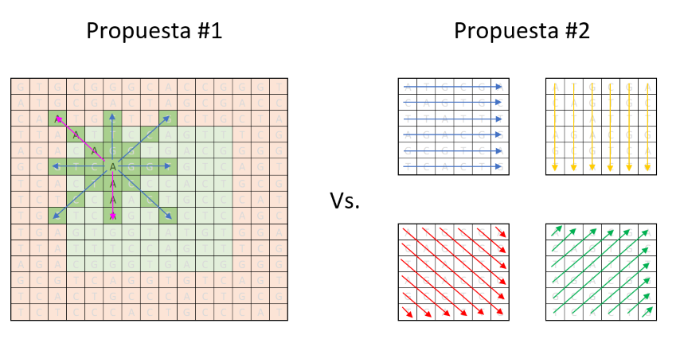

# mutant-ejvt-ml

Este proyecto es la solución propuesta para el análisis de secuencias de ADN, en la cual se recibe como parámetro un array de Strings que representan cada fila de una tabla de (NxN) con la secuencia del ADN. Las letras de los Strings solo pueden ser: (A,T,C,G), las cuales representa cada base nitrogenada del ADN.


## Condiciones/Requerimientos
### Funcionales
1. Crear un programa con un método o función que reciba como parametro el Array de Strings y devuelva si un humano es mutante.
2. El array de strings representa una tabla de (**NxN**)
3. Las letras de los Strings solo pueden ser: **(A,T,C,G)**
4. Sabrás si un humano es mutante, Si encuentras **más de 1 secuencia de cuatro letras iguales**, de forma oblicua, horizontal o vertical

##### Ejemplo
* Para el array:

				String[] dna = {"ATGCGA","CAGTGC","TTATGT","AGAAGG","CCCCTA","TCACTG"};

* La función isMutant(dna) devuelve "**true**".
* Desarrolla el algoritmo de la manera más eficiente posible.

### Técnicos
Estos están más desarrollados en el archivo envido, en resumen son los siguientes:
* Un programa que que cumpla con el método pedido
* Crear una API REST con 2 recursos: `/mutant` y `/stats`
* Hostear API en un cloud computing libre
* Anexar una base de datos, la cual guarde los ADN’s verificados con la API
* Test-Automáticos, Code coverage > 80%.

---
## Solución
### Funcional
La solución al cálculo de las secuencias la abordé de 2 formas:

**Propuesta 1.** Recorrer la matriz en cada una de las posiciones y verificar el vector de cada una de sus direcciones y sentidos.
Implicaciones:
1. Habrían posiciones que no permiten el cálculo de todos sus vectores (zona naranja), por lo tanto dependiendo de la posición, algunos vectores no podrían calcularse. **Por ejemplo**: para la posición [1,1], solo se pueden calcular los vectores con sentido hacia el Este, Sur-Este y Sur.
2. Habría que implementar un mecanismo de duplicados, ya que trata cada posicion en la matriz de forma independiente.

**Propuesta 2.** Recorrer la matriz por filas (horizontalmente), por columnas (verticalmente), por sus oblicuas de pendiente positiva y sus oblicuas de pendiente negativa. De esta forma podría cubrir todos los sentidos que solicita el requerimiento



**Elegí irme con la Propuesta #2**, cómo la implementé?:

1. Elaboré 4 funciones que recorren la matriz NxN, en cada una de las direcciones identificadas (horizontales, verticales, oblicuas con pendiente positiva y oblicuas con pendiente negativa). **Clase MutantAnalyzer.java**

2. Cada una de las funciones lo que hace es recorrer el array parámetro, toma la cadena de la posicion **fila** y la subcadena de la posicion **columna** y en su recorrido va guardando su anterior posición; cuando encuentra 4 de ellas  (`secuenciaDeIguales`), la acumula como una secuencia encontrada (`contadorSecuencia`). Cuando termina el recorrido, devuelve el conteo de secuencias encontradas. **Funciones recorrerHorizontal(), recorrerVertical(), recorrerOblicuasPositivas(), recorrerOblicuasNegativas()**

3. La **función isMutant** lo que hace es recibir el parámetro (Array) o tomarlo del constructor de la clase (para el caso en que sea invocado desde el API); hace cada uno de los recorridos, suma lo que devolvió cada uno de esos recorridos y basado en el número mínimo de secuencias para ser mutante (2) en la varibale (`numeroDeSecuenciasParaSerMutante`) responde falso o verdadero. Por último imprime por consola la matriz y el resumen de lo que encontró en cada recorrido. **Método mostrarResumen()**.

4. Antes de hacer los recorridos se valida que la matriz esté correctamente formada:
	1. No esté vacía o nula
	2. Filas (# de cadenas dentro del array) y columnas (# de caracteres dentro de cada cadena dentro del array) sean la misma cantidad.
	3. Se toma como referencia el tamaño de la primera cadena del array. Si es de 4 caracteres, se asume que la matriz es de 4x4. **Método paramValidations()**.


### Técnica
##### Nivel 1
* Una Clase hecha en lenguaje Java (8), construida en un proyecto Maven. **Clase MutantAnalyzer.java**
* Utilización de librería slf4j


##### Nivel 2
* La implementación de una clase de tipo Spring Boot Application. **Clase ApiService.java**
* Los métodos de esa clase exponen cada uno de los recursos REST que requerimos: 
	
+ Método mutant (*/mutant*) - Interfaz REST para extender la funcionalidad de la clase *MutantAnalyzer.java*. El parámetro es una estructura JSON con una pareja "adn" y como valor, el array que se le va a pasar a MutantAnalyzer. La respuesta es HTTP 200-OK en caso de ser mutante y 403-Forbidden en caso de no serlo. Además devuelve en el cuerpo de la respuesta REST, una estructura JSON con el siguiente formato
	

```
{
    "isMutant" = true,
    "horizontales" = 1,
    "verticales" = 1,
    "oblicuas_positivas" = 0,
    "oblicuas_negativas" = 1
}
```


+ Método statistics (*/stats*) - Interfaz REST para obtener la cantidad de analisis que se han hecho con resultados humanos, mutantes y su proporción. La respuesta es HTTP 200-OK con la siguiente estructura


```
{
    "count_mutant_dna": 8,
    "count_human_dna": 3,
    "ratio": 2.67
}
```


+ Método random (*/random*)* - Interfaz REST que genera una estructura JSON con secuencias aleatorias de ADN, para que puedan ser utilizadas en el recurso Mutant. El valor por defecto es 4, pero si se establece el parámetro "tamanho", se devolverá una matriz de ese tamanho


```
{
    "dna": [
        "GGAGGGCG",
        "GTGTCGAA",
        "GCGCTTCT",
        "CAAATATC",
        "GTTGCCTG",
        "ATAGGCGC",
        "AGCTGGCA",
        "AAGGAGTT"
    ]
}
```


* El Proyecto se encuentra alojado en **GitHub**

* Elegí **Heroku** como plataforma para ejecutar mi proyecto en producción, ya que me permite:
	* Provisionar fácilmente un contenedor 
	* Me entrega una base de datos PostgreSQL, lista para su uso
	* Vinculación del código fuente en **GitHub**, para despliegues automáticos

[](https://heroku.com/deploy)


##### Nivel 3


This application is based on the [Getting Started with Java on Heroku](https://devcenter.heroku.com/articles/getting-started-with-java) article - check it out.

[](https://heroku.com/deploy)

## Quieres ejecutarlo localmente?

**Make sure you have Java and Maven installed.  Also, install the [Heroku CLI](https://cli.heroku.com/)**.


```sh
$ git clone https://github.com/ejvargas/mutant-ejvt-ml.git
$ cd mutant-ejvt-ml
$ mvn clean install
$ heroku local:start
```

Your app should now be running on [localhost:5000](http://localhost:5000/).

If you're going to use a database, ensure you have a local `.env` file that reads something like this:

```
JDBC_DATABASE_URL=jdbc:postgresql://localhost:5432/java_database_name
```

## Desplegando en Heroku

```sh
$ heroku create [YOUR_APP]
$ git push heroku main
$ heroku open
```

## Documentation

For more information about using Java on Heroku, see these Dev Center articles:

- [Java on Heroku](https://devcenter.heroku.com/categories/java)
